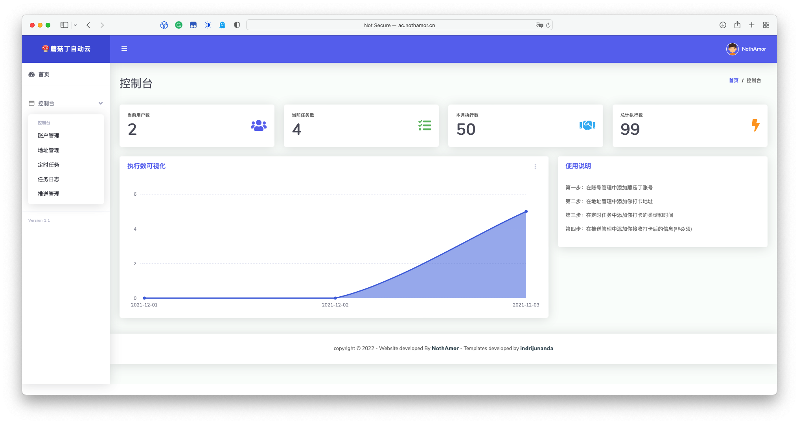
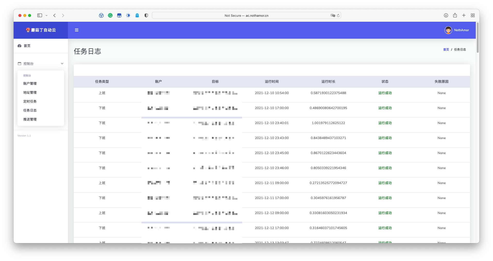
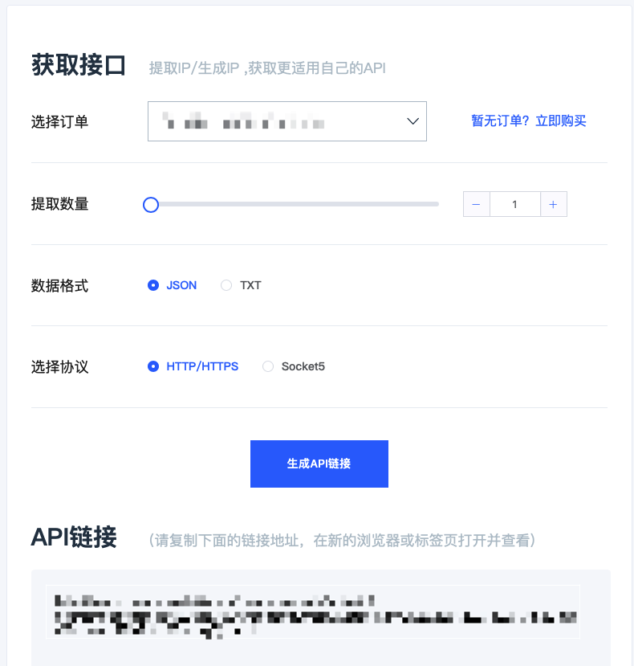

# MoGuDing-Web

蘑菇丁自动打卡平台，基于flask进行制作


## 已完成的功能点

1. 控制台登陆注册

2. 添加蘑菇丁账户

3. 获取蘑菇丁账户token

4. 如不填写user-agent则进行随机生成

5. 打卡地址功能

6. 使用APScheduler进行指定时间的打卡

7. 在每次对任务变更后，程序重新设置一次cron任务

8. 每次执行任务后进行日志记录

9. 添加定时任务的立即执行

10. 在蘑菇丁添加对服务器IP的屏蔽后，可以在`config.py`中的proxies设置https代理

11. 对接熊猫代理，自动获取代理IP

    

## 直接使用

我搭建在了我的服务器上，地址为：

http://ac.nothamor.cn:5000

**请勿攻击，打垮一次，永不开放**

**仅供学习参考使用，如学习过程中蘑菇丁账户被封禁，本人不负任何责任，如果使用本平台，则默认同意如上条件**

**一定一定一定注意好地址的添加，经纬度和填写的详细地址一定要对应的上，一般被封禁都是地址填写的问题！！**


## 效果图





## 部署该项目

在terminal中运行如下命令

```shell
git clone https://github.com/NothAmor/MoGuDing-Web.git
cd MoGuDing-Web
pip3 install -r requirements.txt
```

首先进行配置`app/db/db.py`文件中的数据库信息，填写好自己的数据库信息

不必自己去创建数据表，程序启动自动连接数据库进行数据表创建


### 如果你的服务器IP被蘑菇丁屏蔽了

---

1. 访问熊猫代理官方网站：http://www.xiongmaodaili.com/

   购买代理IP套餐，并按照如下图进行API链接生成



2. 将生成的API链接填入`config.py`文件结尾中，位置已经用注释标注出了


### 如果你的服务器IP没有被蘑菇丁屏蔽

1. 将`mdimgs/withoutProxy/cron.py`剪切到`app/cron/`中将`cron.py`替换

   将`mdimgs/withoutProxy/views.py`剪切到`app/views/`中`views.py`替换


在控制台运行：

```shell
python3 run.py
```